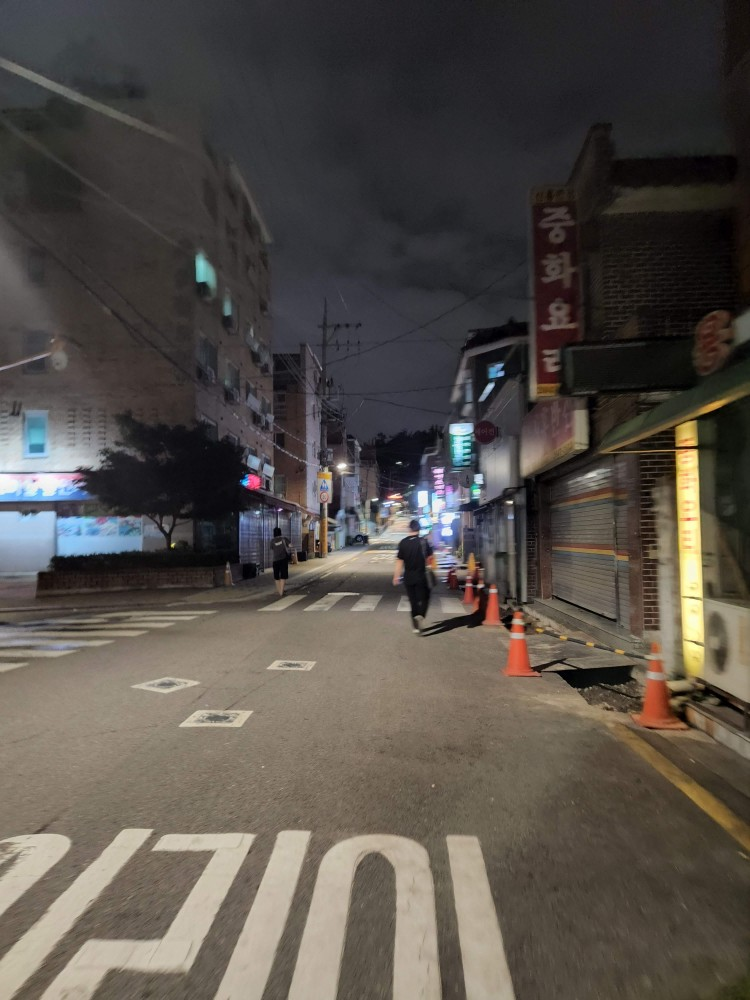
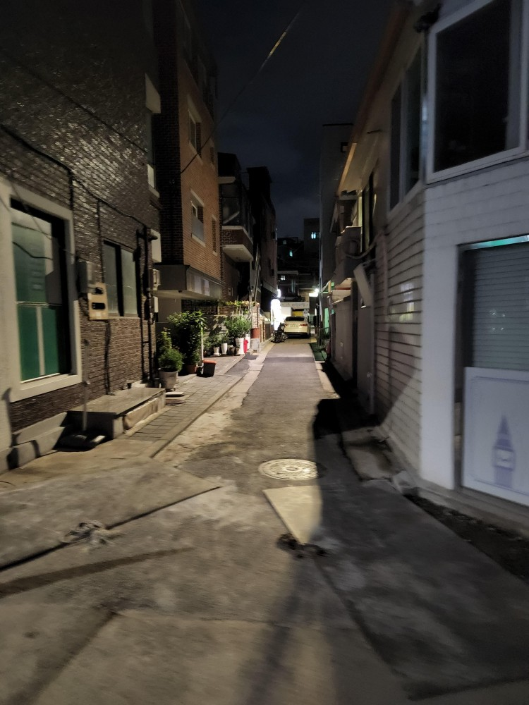
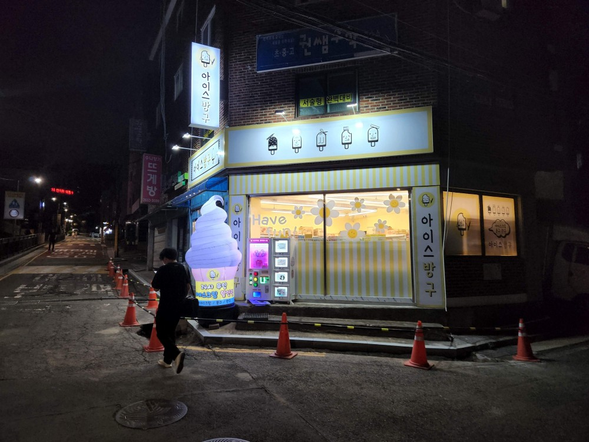
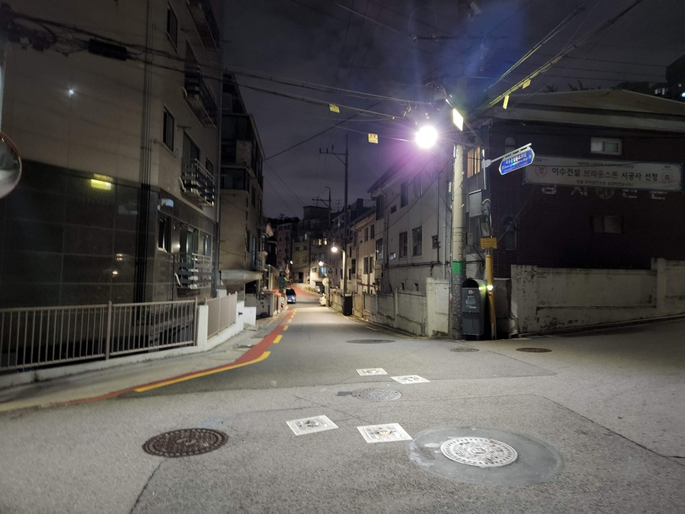
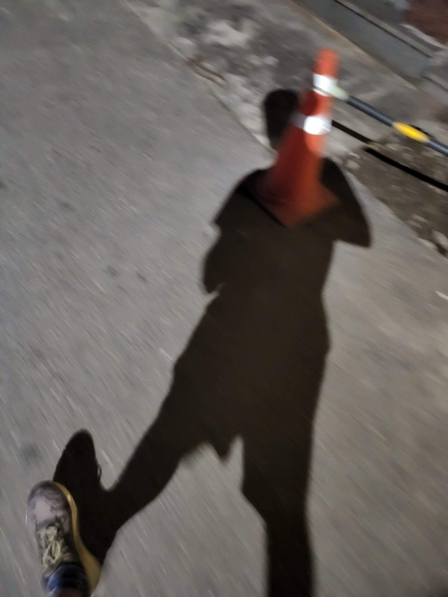

While Seoul knows no sleep, my neighborhood grows quiet at night. There aren't many people out and about. The absence of sounds of traffic enhances the peaceful feeling. 

Seoul is [notorious](http://www.koreaherald.com/view.php?ud=20210309000162) for long work hours. Then the Government announced last year that work hours per week were to be [capped](https://www.theregister.com/2021/06/24/south_korea_52_hour_working_week/) at 52 hours per week. 

The place I live in has many "villas", less expensive alternatives for a high-rise apartments. Many don't have elevators. They offer better value for money per square foot of living space. They are usually quieter neighborhoods, like this one.

This is a 24-hour unmanned ice-cream shop. There is now a proliferation of these shops. You go in, pick up the ice cream you want, and pay for it at the self checkout. There's no one watching to make sure you pay (just a camera recording), but there's so little crime here that someone running away with a free ice cream almost never happens. People pay for what they buy. 

'[Arbeit](https://www.thefreedictionary.com/Arbeit)' (part time) work, the source of pocket money for many young people, is slowly disappearing. Previously there would have been a young college going person here, earning a few extra bucks while they browse the internet during the downtime. Now it's a machine.

 

I bought a pistachio icecream from the self-checkout. I've not had a late 
night ice cream in a very long time. I can't say I enjoyed the flavor as much as I thought I would. As usually happens, fantasy isn't supported by reality.

This is the  final intersection before I turn into the lane leading up to my house. Even at this late hour, it is well lighted. Just to the right of this intersection is a 'child safe area' with an emergency button. 

While Korea has a reputation for being safe, there are many cases of sexual harassment, and laws are being amended to make the usually light punishment for rape harsher ([Example](https://ksr.hkspublications.org/2019/07/16/in-south-korea-being-drunk-is-a-legal-defense-for-rape/) of shockingly light sentence for rape). And in the recent past there have been horrific instances of cyber harrassment ([nth room scandal ](https://www.esquire.com/uk/culture/tv/a40018199/what-is-nth-room-true-story-cyber-hell-destroy-the-nth-chatroom-netflix/)).

 Having said all that, Seoul still feels safe. I'm not sure I would be comfortable with my daughter going out at this time of the night in Chennai, for example. In Seoul, safety feels less enforced by law and more by societal norms. I'm not sure how long this will last but I'm happy to take what I get.

Thanks for reading!