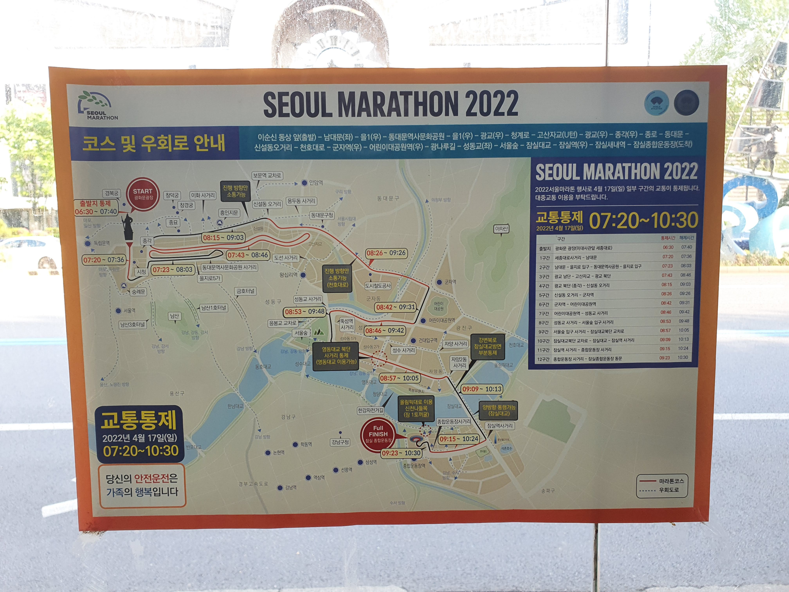
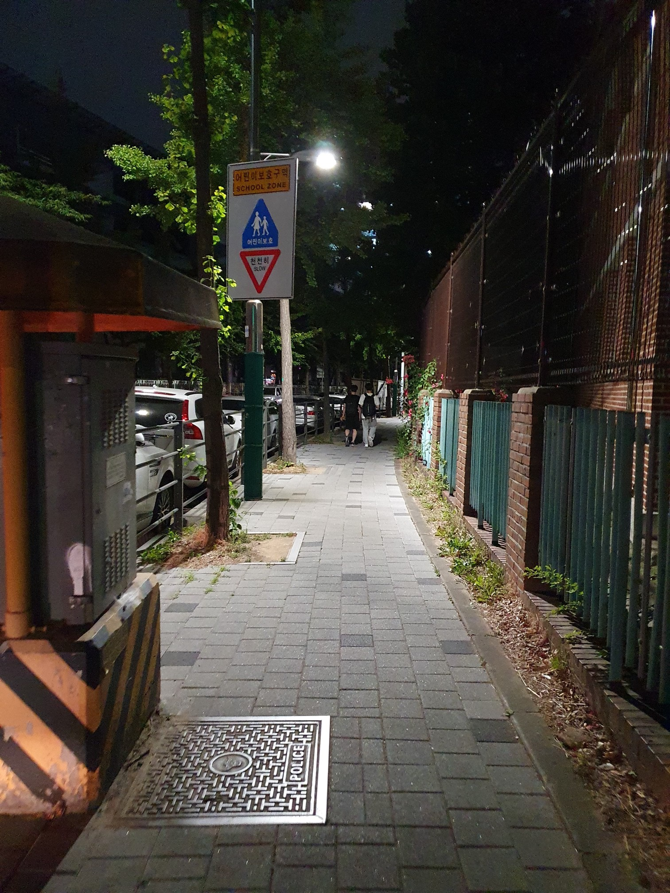
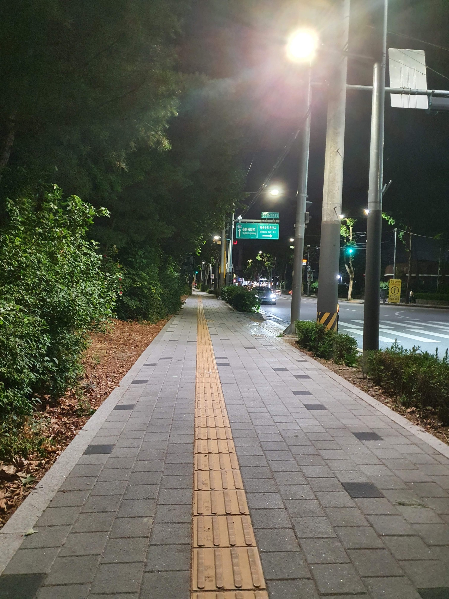
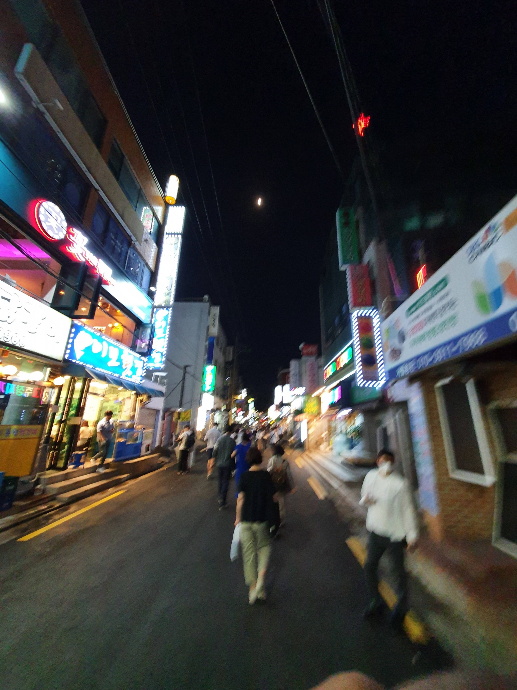
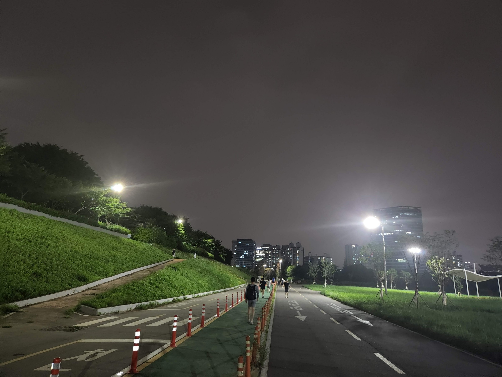
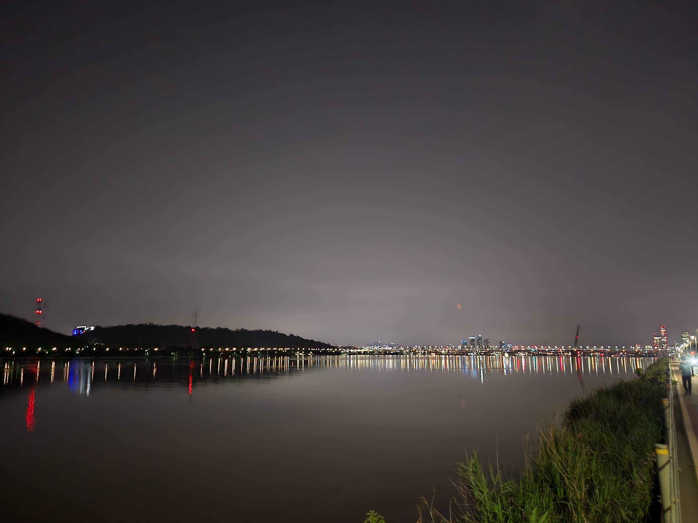
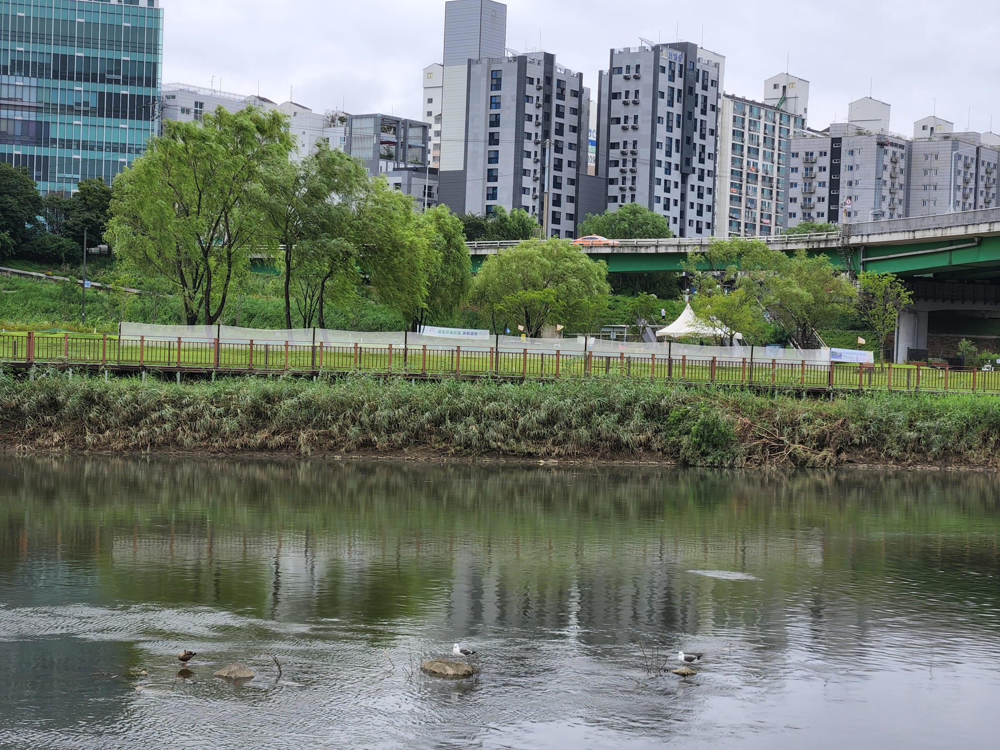
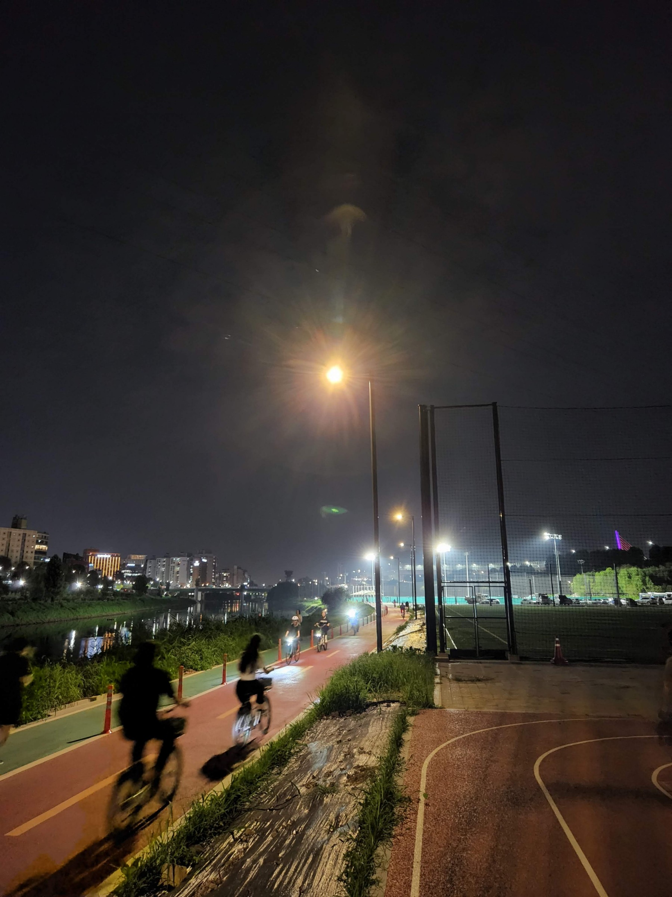
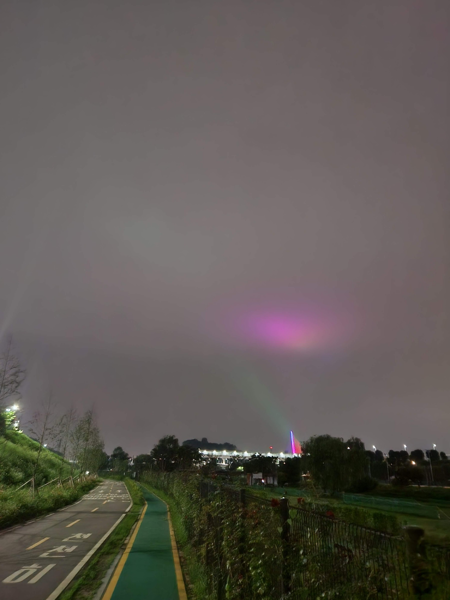

One day in May, I was returning home from work when I saw a poster for the Seoul Marathon 2022. The event had come and gone, and I had been unaware of it. 

I started running some time in June this year. I've made it a tradition to take a shot of whatever is in front of me when I finish my runs. I don't think any of these shots are "special" in a visual way. But it's fun to take a look anyway and reflect on some of them.

I am usually not an early riser, so a lot of my runs happen at night. I am able to unwind after the day's work. 

---

The brown fence on the right belongs to a school. The kids in the above shot are probably going back home after extra tuition - probably from a [hagwon](https://en.wikipedia.org/wiki/Hagwon). Very few kids in Korea get to play after school hours - most go for more classes and tuitions.

---

My usual route is a 3.75 KM round trip from my house along this road. This particular lane is spectacular in fall, when the leaves are yellow and red. The yellow [tactile paving](https://en.wikipedia.org/wiki/Tactile_paving) is ubiquitous in Korea.

---

A market on my way home. Korean store fronts have plenty of neon, but the moon on this night was bright enough to shine despite all that. 

---

This is a biking track 10 mins away from my house. On the right is an inline skating track, which I've used for interval runs. 

---

I love running by the Han River. On the hottest of days there's a gentle breeze.

---

If I run before the sun goes down, I get to see birds by the river. The two birds on the right look like [Black Tailed Gulls](https://en.wikipedia.org/wiki/Black-tailed_gull) .



Black Tailed Gulls are the offical mascot of [Dokdo](https://en.wikipedia.org/wiki/Liancourt_Rocks), the disputed islands between Korea and Japan.

---

On the right is a short track for running, beside a soccer field, which is beside  floodlit tennis courts.

The [World Cup Bridge](https://map.naver.com/v5/entry/place/18809568?c=14124662.5258485,4515546.5956579,14,0,0,0,dh&p=Vr5FQDykm7oK06RLXYgohA,15.87,18.63,80,Float) lights up at night. There's a lot of light and color at night in Seoul, and I love it.  

