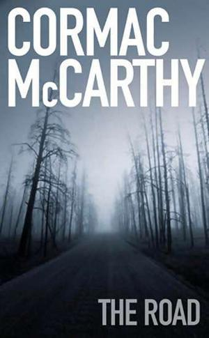

In "The Road", a father and son are making their way towards the sea in a world in which an apocalyptic event has killed most living things. 

It's winter, and it's snowing. Their clothes and shoes are threadbare. They sleep under tarpaulin on the hard ground. During their walk, they manage to find some gasoline, which is useful to build fires, to cook food, to keep warm.

Then this happens:

> *The day following they trekked on till almost dark. He could find no safe place to make a fire. When he lifted the tank from the cart he thought that it felt light. He sat and turned the valve but the valve was already on. He turned the little knob on the burner. Nothing. He leaned and listened. He tried both valves again in their combinations. The tank was empty. He squatted there with his hands folded into a fist against his forehead, his eyes closed. After a while he raised his head and just sat there staring out at the cold and darkening woods.*
> 
> *They ate a cold supper of cornbread and beans and franks from a tin. The boy asked him how the tank had gone empty so soon but he said that it just had.*
> 
> *You said it would last for weeks.*
> 
> *I know.*
> 
> _But it’s just been a few days._
> 
> *I was wrong.*
> 
> *They ate in silence. After a while the boy said: I forgot to turn off the valve, didnt I?*
> 
> *It’s not your fault. I should have checked.*
> 
> *The boy set his plate down on the tarp. He looked away.*
> 
> *It’s not your fault. You have to turn off both valves. The threads were supposed to be sealed with teflon tape or it would leak and I didnt do it. It’s my fault. I didnt tell you.*
> 
> *There wasnt any tape though, was there?*
> 
> *It’s not your fault.*

What was the father thinking, sitting there with his fists against his forehead? Was he waiting for his anger to pass? Was he fighting the feeling of despair? 

Would the father have scolded the boy if the circumstances were different, and they weren’t fighting for their lives? 

McCarthy doesn't say. Makes me think though. There is so much room for me to grow as a parent.

---
