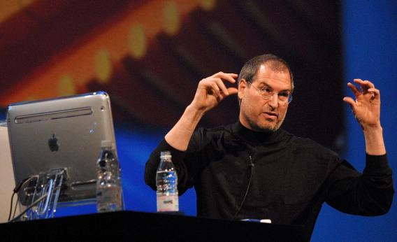

+++
title= "The Third Story"
date= "2022-07-10"
draft= false
description= "\"My third story is about death\""
tags= ["life"]
series = "Steve vs Me"
+++

> My third story is about death.

The third story is impeccable. I do not have much to comment except at the very end. 

Most of this part of the speech is very real and inspiring. It's the carpet that ties the room together.

> When I was 17, I read a quote that went something like: "If you live each day as if it was your last, someday you'll most certainly be right." It made an impression on me, and since then, for the past 33 years, I have looked in the mirror every morning and asked myself: "If today were the last day of my life, would I want to do what I am about to do today?" And whenever the answer has been "No" for too many days in a row, I know I need to change something.

I know the feeling of "no, I don't want to do this today if it were my last day". I'm glad I listened to it when I quit Samsung in 2009. I hope I'll listen to it the next time it appears.

> Remembering that I'll be dead soon is the most important tool I've ever encountered to help me make the big choices in life. Because almost everything — all external expectations, all pride, all fear of embarrassment or failure — these things just fall away in the face of death, leaving only what is truly important. Remembering that you are going to die is the best way I know to avoid the trap of thinking you have something to lose. You are already naked. There is no reason not to follow your heart.

Beautiful.

Steve Jobs talks about his cancer diagnosis, and how close he came to death.

> No one wants to die. Even people who want to go to heaven don't want to die to get there. And yet death is the destination we all share. No one has ever escaped it. And that is as it should be, because Death is very likely the single best invention of Life. It is Life's change agent. It clears out the old to make way for the new. Right now the new is you, but someday not too long from now, you will gradually become the old and be cleared away. Sorry to be so dramatic, but it is quite true.

> Your time is limited, so don't waste it living someone else's life. Don't be trapped by dogma — which is living with the results of other people's thinking. Don't let the noise of others' opinions drown out your own inner voice. And most important, have the courage to follow your heart and intuition. They somehow already know what you truly want to become. Everything else is secondary.

Courage. If the call comes, we need courage to hear it, and we need courage to answer it. It's a lesson I need to come back to again and again.

To get courage, we have to remember that we have nothing to lose. 

> Stay Hungry. Stay Foolish.

Jobs gives us permission to be dissatisfied with where we are, to make mistakes.  

We are always looking outward for fulfillment. We get the things we seek and we continue to be unfulfilled. There's the next thing to get, then the next.

I ask you: should we accept this perpetual state of dissatisfaction? What will make us satisfied once and for all?

And to answer _that_ question, we must begin with knowing ourselves. 

RIP Steve. You're missed.